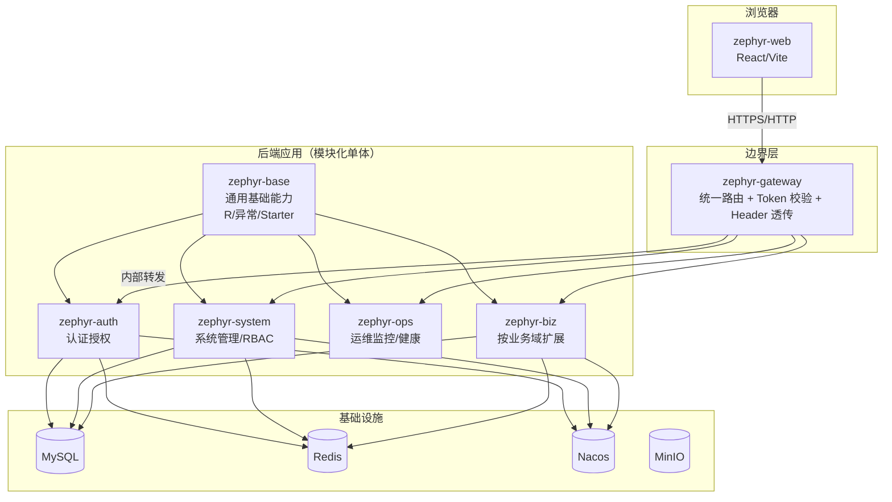
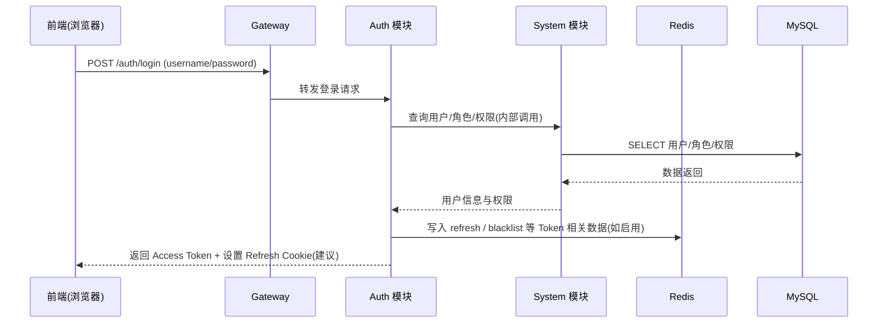
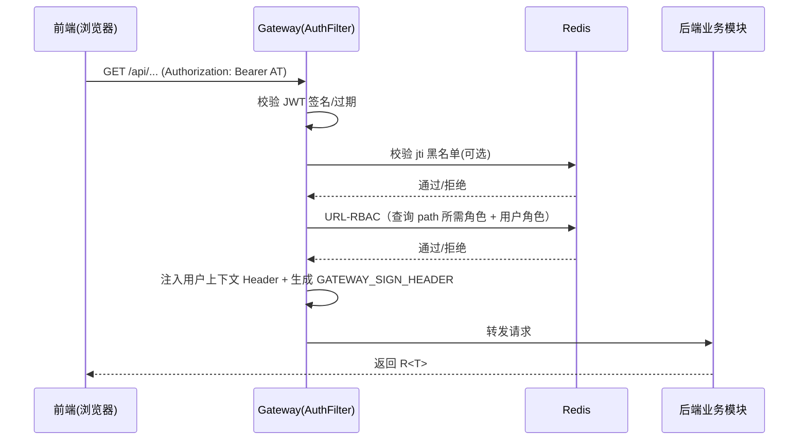

# 系统架构总览（Zephyr Admin）

> 本文档用于给新同学/评审者一个“一眼看懂”的系统全景：系统边界、核心组件、关键链路、部署形态与非功能性设计。  
> 当前阶段以 **模块化单体（一个后端主应用）+ 网关** 为主；未来如拆分微服务，可在此文档的“演进方向”章节补充。

---

## 文档元信息

| 字段 | 值 |
|---|---|
| 状态 | Draft |
| Owner | Zephyr 文档维护者 |
| 最后更新 | 2026-06-08 |
| 适用范围 | 全栈架构（前端/网关/后端/基础设施） |
| 版本口径 | 版本号与端口以《[版本与环境矩阵](../../00-项目简介/00-版本与环境矩阵.md)》为准 |
| 关联文档 | [后端工程结构设计](../2.1-后端设计/03-后端工程结构设计.md)、[登录与鉴权全链路](../2.3-安全与权限/01-登录与鉴权全链路.md)、[安全基线、数据权限与审计](../2.3-安全与权限/02-安全基线、数据权限与审计.md) |

---

## 1. 背景与目标

### 1.1 架构目标
- **统一入口**：所有外部 API 统一经由 Gateway 进入。
- **安全与可控**：认证鉴权链路清晰，权限模型可演进；敏感信息不落盘。
- **可维护**：模块边界清晰（base/common/biz），降低跨模块耦合。
- **可扩展**：在保持单体交付效率的同时，为未来微服务拆分预留路径。

### 1.2 非目标（当前阶段）
- 不在本阶段做“按业务域全面拆分微服务”的交付承诺。
- 不在本总览中穷举所有业务功能细节（详见功能设计/数据库设计）。

---

## 2. C4 · Context（系统边界）

```mermaid
flowchart LR
  U[后台用户/管理员] -->|浏览器访问| WEB[Zephyr Web 前端]
  WEB -->|API 请求| GW[Zephyr Gateway]
  GW --> APP[Zephyr 后端主应用\n(模块化单体)]
  APP --> DB[(MySQL)]
  APP --> RDS[(Redis)]
  APP --> NACOS[(Nacos)]
  APP --> OSS[(MinIO/OSS)]

  DEV[开发者/运维] -->|部署/配置| NACOS
  DEV -->|查看日志/监控| APP
```

说明：
- 前端仅通过 Gateway 访问后端能力。
- 后端应用基于 go-zero 微服务框架划分能力（详见后端工程结构设计）。

---

## 3. C4 · Container（核心组件划分）



网关职责边界（建议）：
> 以当前项目约定为准（详见《网关设计》）。

- **做**：身份认证（JWT 校验/过期/签名）、URL-RBAC 粗粒度鉴权、统一 CORS/限流、路由转发、注入可信 Header，并生成 `GATEWAY_SIGN_HEADER` 供下游校验网关身份。
- **不做**：细粒度业务权限（按钮级 perms、数据权限等）与业务逻辑（下沉到后端模块/注解/拦截器）。

---

## 4. 核心链路时序

### 4.1 登录（签发 Token）



> 建议：Access Token 放 Header；Refresh Token 放 HttpOnly Cookie，并配合 Redis 存储与黑名单（详见《登录与鉴权全链路》）。

### 4.2 业务请求鉴权（网关校验 + Header 透传）



---

## 5. 部署视图（当前：单体为主）

### 5.1 本地开发（建议）
- 基础设施：MySQL / Redis / Nacos / MinIO 使用 Docker Compose 一键启动。
- 应用：
  - Gateway 单独启动（或容器启动）
  - 后端主应用（模块化单体）以 IDE 或脚本启动
  - 前端 `pnpm dev` 启动

### 5.2 环境差异（要在上线前补齐）
- 配置来源：本地 `.env/.yml` → Nacos / 环境变量
- 日志与可观测：本地文件/控制台 → 统一采集（ELK/OTel/Prometheus 等，按团队现状选型）

---

## 6. 非功能性设计（NFR）

### 6.1 安全
- Token：短期 Access Token + 长期 Refresh Token（Cookie）优先；登出/封禁使用 Redis 黑名单。
- 密码：BCrypt；敏感配置不入库不入 Git。
- CORS：优先在 Gateway 统一配置；CSRF 视 Cookie 使用策略决定是否启用。

### 6.2 可观测性
- 统一请求链路标识：`X-Request-Id`（前端生成/网关兜底）。
- 日志：按模块/业务域分 logger；错误日志必须含 requestId、userId（脱敏）。

### 6.3 性能与稳定性
- 读多写少场景：权限/字典等可 Redis 缓存（明确 Key 规范与 TTL）。
- 分页查询：统一分页插件与索引策略；禁止 `SELECT *`。
- 限流：优先在网关层做（按 IP/用户/接口）。

---

## 7. 演进方向（未来可选）

当业务域增长或需要独立扩缩容时，可将 `zephyr-biz` 的部分域拆分为独立服务，并保持：
- “网关统一入口不变”
- “OpenAPI 契约先行不变”
- “认证授权中心化（或统一鉴权组件化）不变”
