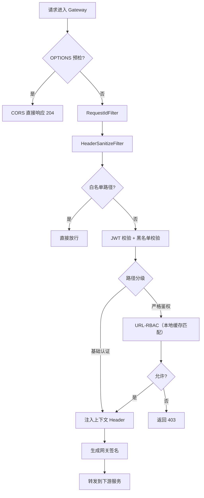
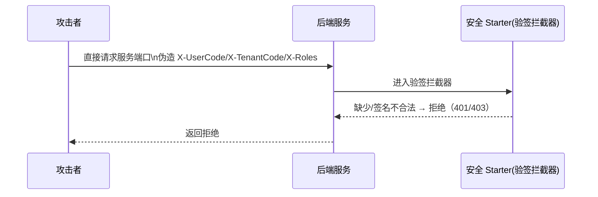
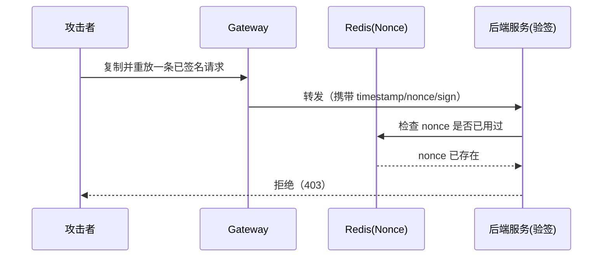

# 网关设计（zephyr-gateway）

> 本文档沉淀 Zephyr Admin 网关（Spring Cloud Gateway）的设计目标、职责边界、路由与过滤器体系，以及鉴权链路与可观测性方案。  
> 当前系统交付形态以 **模块化单体（后端主应用）+ 网关** 为主；本文的网关设计同样适用未来拆分微服务的演进形态。

---

## 文档元信息

| 字段 | 值 |
|---|---|
| 状态 | Draft |
| Owner | Zephyr 文档维护者 |
| 最后更新 | 2026-06-08 |
| 适用范围 | 后端（网关层） |
| 关联文档 | [系统架构总览](../2.0-总览/00-系统架构总览.md)、[后端工程结构设计](./03-后端工程结构设计.md)、[登录与鉴权全链路](../2.3-安全与权限/01-登录与鉴权全链路.md)、[安全基线、数据权限与审计](../2.3-安全与权限/02-安全基线、数据权限与审计.md)、[技术分享/网关说明](../../06-技术分享/网关说明.md) |

---

## 1. 设计目标（Why）

1. **统一入口**：所有外部 API 请求统一由网关接入与转发，避免业务服务直接暴露。
2. **安全前置**：完成身份认证（JWT 校验）与统一安全策略（CORS、黑名单、基础限流）。
3. **粗粒度鉴权**：在网关层做“基于 URL 的 RBAC”拦截，降低后端模块重复鉴权成本。
4. **治理与可观测**：统一注入 requestId、统一日志格式、统一错误响应结构，提升排障效率。
5. **可信入口**：网关生成签名 Header（`X-Gateway-Sign`），下游服务必须验签，以核验“请求确由网关转发”。

---

## 2. 职责边界（必须遵守）

### 2.1 网关必须做（强制）
- **路由转发**：按路由配置将请求转发到目标模块/服务。
- **身份认证（Authentication）**：JWT 签名与过期校验、黑名单校验（强制）。
- **粗粒度鉴权（Coarse-grained Authorization）**：基于 URL 的 RBAC（角色→路径）判断是否允许访问。
- **统一 CORS**：跨域配置集中在网关层，避免各模块重复维护。
- **请求链路标识**：生成或透传 `X-Request-Id`，并写入日志。
- **上下文透传**：鉴权通过后，将 `UserCode / TenantCode / Roles` 等写入可信 Header 透传给下游。
- **网关身份签名**：生成 `X-Gateway-Sign`，下游验签通过后才信任透传 Header。

### 2.2 网关禁止做
- **细粒度业务权限**：按钮级 perms、数据权限、复杂租户隔离策略等应在后端业务模块完成。
- **业务逻辑**：任何与业务流程相关的判断与数据访问。
- **过重的聚合编排**：避免在网关层组合多个下游请求（会放大耦合与故障面）。

> [!IMPORTANT]
> 本项目约定：**网关做粗粒度 URL-RBAC**（确保“能不能进门”），业务模块做**细粒度权限**（确保“能不能操作/能不能看某条数据”）。这样可以在保证安全的同时，避免把所有权限复杂度堆到网关。

---

## 3. 核心概念（Gateway 组成）

Spring Cloud Gateway 的核心概念：
- **Route**：一条转发规则（id、uri、predicates、filters）。
- **Predicate**：断言，决定请求是否命中路由（Path/Method/Header/Query 等）。
- **Filter**：过滤器，对请求/响应做增强处理。
  - **GlobalFilter**：对所有路由生效。
  - **GatewayFilter**：仅对特定路由生效。

（可参考《技术分享/网关说明》中的概念与示例。）

---

## 4. 路由设计（Routing）

### 4.1 路由分组（强制约定）

按“业务域/模块”分组配置路由，避免路由 id 与 path 混乱：
- `route-auth`：认证相关（登录/刷新/登出）
- `route-system`：系统管理（用户/角色/菜单/字典）
- `route-ops`：运维监控（health、metrics 等）
- `route-biz-*`：业务域扩展（按业务域拆分）

### 4.2 路由示例（约定）

```yaml
spring:
  cloud:
    gateway:
      routes:
        - id: route-auth
          uri: http://localhost:8080   # 单体阶段：可转发至后端主应用
          predicates:
            - Path=/auth/**
          filters:
            - StripPrefix=0

        - id: route-api
          uri: http://localhost:8080
          predicates:
            - Path=/api/**
          filters:
            - StripPrefix=0
```

> 约定：当前阶段所有路由均转发至后端主应用；后续拆分微服务时再按服务维度拆分 `uri`。

---

## 4.3 网关工程目录结构（强制约定）

> 本目录结构用于统一团队协作与代码定位；目录结构变更必须同步更新本文档。

```text
zephyr-gateway/
├── src/main/java/com/zephyr/gateway/
│   ├── config/                     # 网关配置：路由加载、CORS、限流、白名单等
│   │   ├── RouteConfig.java        # 路由配置（可支持从 Nacos 动态加载）
│   │   └── CorsConfig.java         # 统一跨域配置（只在网关层配置）
│   ├── filter/                     # 过滤器：全局入口治理（只放网关职责）
│   │   ├── AuthFilter.java         # 核心：JWT + URL-RBAC + Header 透传 + 网关签名
│   │   ├── RequestIdFilter.java    # 生成/透传 X-Request-Id
│   │   └── HeaderSanitizeFilter.java # 清理伪造 Header（X-UserCode 等 + X-Gateway-*）
│   ├── security/                   # 安全相关组件：签名、nonce、防重放、密钥管理
│   │   ├── GatewaySignUtil.java    # X-Gateway-Sign 签名/验签
│   │   └── NonceStore.java         # nonce 存储（Redis），防重放
│   ├── rbac/                       # 粗粒度鉴权：URL-RBAC 的缓存访问与匹配策略
│   │   ├── RbacService.java        # 获取用户角色/路径所需角色、判定 allow/deny
│   │   └── PathMatcher.java        # AntPathMatcher + 最长匹配优先封装
│   ├── constant/                   # 常量：Header 名、Redis Key 前缀、错误码等
│   ├── model/                      # 结构体：网关注入的 UserContext 等
│   └── exception/                  # 网关统一异常与错误响应封装
└── src/main/resources/
    ├── application.yml             # 网关配置（必须按 env 拆分）
    └── bootstrap.yml               # 如使用 Nacos 配置中心
```

---

## 5. 过滤器体系（Filters）

### 5.1 过滤器链路（强制顺序）

1. **CorsWebFilter / CORS 预处理（最前）**：统一跨域；浏览器 `OPTIONS` 预检请求在最外层**直接短路返回 204**。
2. **RequestIdFilter（全局）**：为非预检请求生成/透传 `X-Request-Id`。
3. **HeaderSanitizeFilter（全局）**：清理客户端伪造的内部可信 Header（`X-UserCode/X-TenantCode/X-Roles/X-Request-Id/X-Gateway-*` 与 `X-Gateway-Sign`）。
4. **AuthFilter（全局）**：白名单判断 → Token 校验 → 黑名单校验 → URL-RBAC 鉴权 → 注入可信 Header → 生成网关签名 → 转发。
5. **RateLimitFilter（全局）**：对所有 RBAC 路径启用限流（基于 Redis 令牌桶）。
6. **ResponseWrapFilter（全局）**：统一错误响应结构（避免下游返回格式不一致）。

> [!IMPORTANT]
> `OPTIONS` 预检请求在 CORS 层直接返回 204，不进入 RequestId、Header 清理、Auth、限流等任何后续链路。

### 5.0 可视化：过滤器链路总览



### 5.2 AuthFilter 关键逻辑（强制）

（与《后端工程结构设计》中描述保持一致）

```
请求进入
  ├─ ① 白名单路径？
  │     ├─ 是 → 直接放行（不注入用户上下文 Header）
  │     └─ 否 → 进入认证/鉴权链路
  │
  ├─ ② 校验 JWT（Authentication）
  │     ├─ 校验签名/exp
  │     ├─ 校验黑名单 jti（强制）
  │     └─ 解析 userCode/tenantCode（JWT 不承载 roles）
  │           └─ roles 通过用户角色缓存获取（Caffeine → Redis，TTL=60s）
  │
  ├─ ③ 路径鉴权分级（Authorization）
  │     ├─ 基础认证路径：只要登录即可访问 → 直接放行
  │     └─ 严格鉴权路径：URL-RBAC → 从 Redis 读取“路径所需角色”并判定
  │            ├─ 通过 → 放行
  │            └─ 拒绝 → 返回 403
  │
  └─ ④ 上下文透传 + 网关签名
        ├─ 注入 X-UserCode、X-TenantCode、X-Roles、X-Request-Id
        ├─ 生成 X-Gateway-Timestamp / X-Gateway-Nonce / X-Gateway-Sign
        └─ 转发
```

### 5.3 路径校验分三级（强制约定）

> 本节与《登录与鉴权全链路》保持一致：**白名单 / 基础认证 / 严格鉴权** 三类路径。

#### A. 白名单路径（Whitelist）
- **特点**：不校验 Token，不做 RBAC。
- **路径清单**：`/auth/login`、`/auth/refresh`、`/auth/captcha`、`/actuator/**`。
- **处理**：直接放行；不注入用户上下文 Header；不生成网关签名。

#### B. 基础认证路径（Authenticated）
- **特点**：必须登录（JWT 合法），但不要求特定角色。
- **路径清单**：`/system/user/info`、`/system/menu/routers`。
- **处理**：JWT 校验通过后直接放行；注入用户上下文 Header；生成网关签名。

#### C. 严格鉴权路径（RBAC）
- **特点**：必须登录 + 必须满足 URL-RBAC（基于角色）。
- **路径范围**：除白名单与基础认证路径外的全部业务 API（以 `/api/**` 为主）。
- **处理**：JWT 校验通过后执行 URL-RBAC（本地缓存匹配规则）；不满足直接返回 403。

> [!IMPORTANT]
> “路径属于哪一类”只能来自配置与缓存（白名单清单 + 基础认证清单 + RBAC 规则源数据），禁止在代码中散落硬编码判断。

### 5.4 白名单策略（强制）

白名单固定为：
- `/auth/login`
- `/auth/refresh`
- `/auth/captcha`
- `/actuator/**`

---

## 6. 安全设计（Security）

### 6.1 内部可信 Header 规则（强制）

1. 网关在转发前**先删除**客户端同名 Header（防伪造）。
2. 网关校验通过后再注入：
   - `X-UserCode`
   - `X-TenantCode`
   - `X-Roles`（逗号分隔）
   - `X-Request-Id`
   - `X-Gateway-Timestamp`
   - `X-Gateway-Nonce`
   - `X-Gateway-Sign`
3. 下游业务模块**必须先校验 `X-Gateway-Sign`**，校验通过后才信任上述 Header。

### 6.2 Token 与黑名单（强制）
- Token 校验：签名、过期时间、`userCode`、`tenantCode`、`jti`。
- 黑名单：登出或封禁时将 `jti` 写入 Redis，TTL=access token 剩余有效期。

### 6.3 URL-RBAC（粗粒度鉴权）设计

#### 关键约定：JWT 不承载 roles（避免角色缓存不一致）（强制）

> JWT 严禁承载 roles：roles 只通过网关缓存/Redis 获取。

#### Redis Key 约定（强制）

1) **路径所需角色集合（按租户隔离）**
```
key: auth:path:roles:{tenantCode}:{httpMethod}:{pathPattern}
value: roleCode 集合（Set<String>）
ttl: 3600s
```

2) **用户当前角色集合（按租户隔离）**
```
key: auth:user:roles:{tenantCode}:{userCode}
value: roleCode 集合（Set<String>）
ttl: 3600s
```

#### 用户角色本地缓存（强制：Caffeine，TTL=60s）

> 约束：网关必须启用“用户角色本地缓存”，避免每个请求访问 Redis。

**结构（固定）**：
```
userRoleCache (Caffeine)
key: {tenantCode}:{userCode}
value: Set<RoleCode>
ttl: 60s
```

**读取策略**：
1. 命中 `userRoleCache` → 直接使用
2. 未命中 → 读取 Redis `auth:user:roles:{tenant}:{user}` → 回填 `userRoleCache`

**一致性策略（强制）**：
- 角色变更时通过 Redis Pub/Sub 发布事件到频道 `auth:user:roles:changed`，网关收到后立即失效对应 `{tenant}:{user}` 的 `userRoleCache`。

#### 性能陷阱：通配符 pattern 无法 O(1) 精确查找

> [!WARNING]
> 若将权限规则按 `auth:path:roles:{tenant}:{method}:{pathPattern}` 直接存 Redis，而 `pathPattern` 包含通配符（如 `/api/system/user/**`），
> 则网关收到请求 `/api/system/user/list` 时无法用“固定 key”进行 O(1) 精确查找。
>
> **严禁**在请求链路中使用 `KEYS` / `SCAN` 去做模糊匹配，这会在高并发下造成 Redis 阻塞，连带拖垮网关。

#### 固定方案：Redis 存储 + 网关本地二级缓存（Caffeine）+ 变更事件增量刷新

目标：将“路径匹配”从 **Redis 在线扫描** 变为 **网关内存匹配**，把延迟稳定控制在个位数毫秒级。

**基本思路**：
1. 网关启动时按租户从 Redis **全量加载** URL-RBAC 规则到本地内存，并构建 `AntPathMatcher + 最长匹配优先` 的匹配索引。
2. 运行时所有请求的“路径匹配”只在网关内存中完成，不访问 Redis 做 pattern 扫描。
3. 权限变更时通过 **Redis Pub/Sub** 发布事件到频道 `auth:rbac:changed`；网关订阅该频道并 **增量更新** 本地缓存。

**本地缓存结构（固定）**：
- Key：`{tenantCode}:{httpMethod}` → Value：该租户该方法下的 `List<Rule>`（按 pattern 长度降序）
- Rule：`pattern` + `requiredRoles(Set)` + `mode`（基础认证/严格鉴权）

**变更事件（固定）**：
- 事件类型：`RBAC_RULE_UPDATED` / `RBAC_RULE_DELETED` / `RBAC_RULE_RELOAD`
- 事件载荷：`tenantCode` + `httpMethod` + `pathPattern` + `requiredRoles`

网关权限规则刷新机制固定为 Redis Pub/Sub，不使用 Nacos 刷新权限规则。

#### 匹配策略（强制）
- pathPattern 支持通配：`/api/system/user/**`
- 同时按 HTTP Method 维度匹配（GET/POST/...）
- 当命中多个 pattern 时，按“最长匹配优先”选择最终规则

#### 授权判定（强制）
- `path` 无配置：直接拒绝（403）
- 所需角色集合为空：表示“登录即可访问”（Authenticated）
- 否则：用户角色集合与所需角色集合求交集，非空则通过；为空则拒绝（403）

### 6.4 X-Gateway-Sign（网关身份签名，强制）

目的：防止绕过网关直接调用下游服务时伪造 `X-UserCode/X-TenantCode/X-Roles` 等内部可信 Header。

#### Header 约定（强制）
- 代码常量：`GATEWAY_SIGN_HEADER = "X-Gateway-Sign"`
- `X-Gateway-Timestamp`: 毫秒时间戳
- `X-Gateway-Nonce`: 随机串（防重放）
- `X-Gateway-Sign`: 签名

#### 签名算法（强制：HMAC-SHA256）

**Canonical String（固定）**：
```
{timestamp}\n{nonce}\n{method}\n{path}\n{tenantCode}\n{userCode}\n{requestId}
```

**Signature**：
```
base64( HMAC_SHA256(secret, canonicalString) )
```

#### 下游校验规则（强制）
1. 校验时间戳与当前时间偏差 ≤ 5 分钟。
2. 校验 nonce 未被使用过（nonce 写入 Redis：TTL=300s）。
3. 用同一 secret 重新计算签名，与 `GATEWAY_SIGN_HEADER` 比对一致才通过。
4. 校验通过后才允许读取并信任 `X-UserCode/X-TenantCode/X-Roles` 等 Header。

#### 高并发约束（强制）
1. canonicalString 固定为本节给出的最小字段集合（不包含 roles）。
2. 下游验签强制开启，任何环境均不允许关闭。

> 本文与《登录与鉴权全链路》存在冲突时，以《登录与鉴权全链路》为准。

---

## 10. 攻击场景可视化（用于评审/联调）

### 10.1 伪造内部可信 Header（绕过网关）



### 10.2 重放攻击（Replay）



---

## 7. 可观测性与排障（Observability）

### 7.1 日志字段（强制）

网关日志必须统一输出（至少）：
- `requestId`
- `method` / `path`
- `status`
- `latencyMs`
- `userId`（若已鉴权，通过脱敏或仅记录内部 id）
- `routeId`
- `clientIp`

### 7.2 指标（强制）
- 每路由 QPS、P95/P99 延迟
- 401/403/5xx 比例
- 限流触发次数
- 下游连接/超时统计

---

## 8. 变更影响面（强制）

以下变更必须同步更新本文档与相关文档：
- 白名单路径变更
- Token 结构、算法、Header 约定变更
- 内部可信 Header 名称与注入策略变更
- 路由结构（path/uri/routeId）变更

---

## 9. 演进方案：抽取安全 Starter（强制）

> 为了无缝演进到微服务，下游服务通用的安全逻辑必须抽成可复用组件。

### 9.1 必须抽取 `zephyr-common-security-starter`

**承载能力（强制）**：
1. **网关验签过滤器/拦截器**：校验 `GATEWAY_SIGN_HEADER`、时间戳偏差、nonce 防重放（Redis）。
2. **内部可信 Header 解析**：解析 `X-UserCode/X-TenantCode/X-Roles/X-Request-Id` 并注入上下文。
3. **安全上下文注入**：
   - Servlet（MVC）：`OncePerRequestFilter` + `ThreadLocal`（或 TransmittableThreadLocal）
   - WebFlux：`Reactive Context`（避免直接 ThreadLocal）
4. **强制验签**：任何环境均不允许关闭验签。

**收益**：
- 单体阶段：主应用直接引入 starter 即可“自动验签 + 自动注入上下文”
- 微服务阶段：新拆分服务只需引入 starter，即可零代码融入安全体系

### 9.2 与网关配合约定（强制）
- 下游服务任何需要信任用户上下文 Header 的入口，必须先通过验签组件。
- 网关与下游必须共享相同的签名密钥管理方式，并支持密钥轮换。
