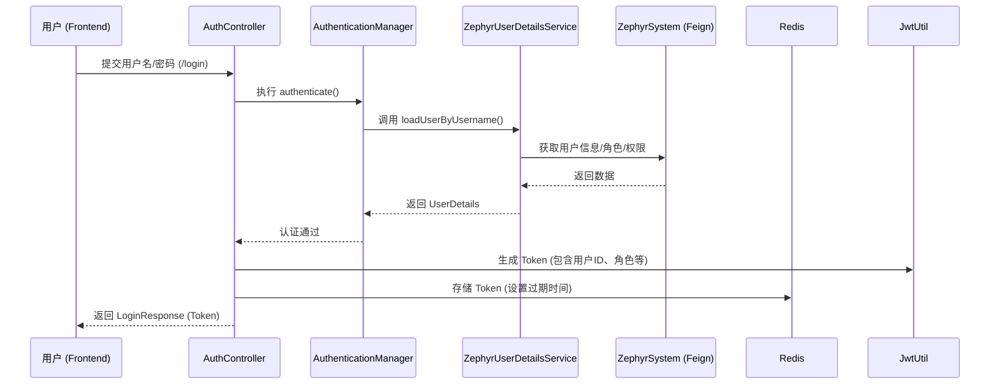

# 认证授权设计

## 1. 模块概述

`zephyr-auth` 模块是 Zephyr Admin 系统的核心安全组件，负责用户的身份验证（Authentication）和授权（Authorization）。该模块基于 Spring Security 6.x 和 JWT（JSON Web Token）实现，采用了无状态（Stateless）的设计理念，适用于微服务架构。

### 1.1 模块结构

模块分为 API 层和业务实现层：

- **`zephyr-auth-api`**: 包含 Feign 客户端定义和通用的 DTO/VO（如 `LoginRequest`, `LoginResponse`），供其他微服务调用认证相关功能。
- **`zephyr-auth-biz`**: 核心业务逻辑实现，包括安全配置、JWT 过滤器、用户详情服务等。

---

## 2. 核心设计思想

1.  **无状态认证**: 弃用传统的 Session 机制，采用 JWT 作为身份令牌。服务器不保存用户登录状态，增强了系统的水平扩展能力。
2.  **解耦设计**: 认证模块通过 Feign 接口（`IUserClient`）从 `zephyr-system` 模块获取用户信息、角色和权限标识，实现了认证逻辑与基础数据管理的解耦。
3.  **多维度权限**: 支持角色（Role）和权限标识（Permission/Button）双重控制。
4.  **安全可靠**: 使用 BCrypt 强哈希算法存储密码，并结合 Redis 实现 Token 的生命周期管理（支持主动注销）。

---

## 3. 详细设计

### 3.1 核心组件说明

| 组件名称 | 职责描述 |
| :--- | :--- |
| `SecurityConfig` | Spring Security 核心配置类，定义过滤器链、禁用 CSRF/CORS、配置无状态策略等。 |
| `JwtAuthenticationFilter` | JWT 拦截器，负责从 HTTP Header 中提取 Token，通过 `JwtUtil` 验证有效性，并填充 `SecurityContext`。 |
| `ZephyrUserDetailsService` | 实现 `UserDetailsService` 接口，调用 `zephyr-system` 的 Feign 接口加载用户详细信息。 |
| `ApplicationConfig` | 配置 `AuthenticationManager`、`AuthenticationProvider` 和 `PasswordEncoder` (BCrypt)。 |
| `AuthController` | 暴露登录（`/login`）、用户信息（`/info`）和登出（`/logout`）等核心 API。 |

### 3.2 认证流程（登录）

### 3.3 授权流程（请求拦截）

1.  前端在 HTTP Header 中携带 `Authorization: Bearer <token>`。
2.  `JwtAuthenticationFilter` 拦截请求：
    -   解析 Token 获取 `username`。
    -   调用 `ZephyrUserDetailsService` 加载最新的权限数据。
    -   验证 Token 签名和有效期。
    -   将用户信息存入 `SecurityContextHolder`。
3.  后续逻辑（或网关）根据 `SecurityContext` 中的权限标识判断是否有权访问。

---

## 4. 关键接口定义

### 4.1 登录接口 (`POST /login`)
- **入参**: `username`, `password`
- **出参**: `token`, `userId`, `refreshToken`
- **逻辑**: 验证凭据 -> 生成 JWT -> 存入 Redis -> 返回。

### 4.2 获取用户信息 (`GET /info`)
- **入参**: Header 中的 Token
- **逻辑**: 从 Token 中解析用户名 -> 调用 `IUserClient` 查询完整信息（包含角色 Code 和权限标识） -> 返回给前端。

### 4.3 登出接口 (`GET/POST /logout`)
- **逻辑**: 从 Redis 中删除对应的 Token 记录。

---

## 5. 安全建议

-   **Token 刷新**: 目前 `refreshToken` 与 `token` 相同，后续应引入双 Token 机制（Access Token + Refresh Token）。
-   **黑名单**: 登出后应将 Token 加入 Redis 黑名单，直到其自然过期，防止 Token 被盗用后依然有效。
-   **动态权限**: 目前权限在登录时加载，若权限发生变更，用户需重新登录或等待缓存过期。
